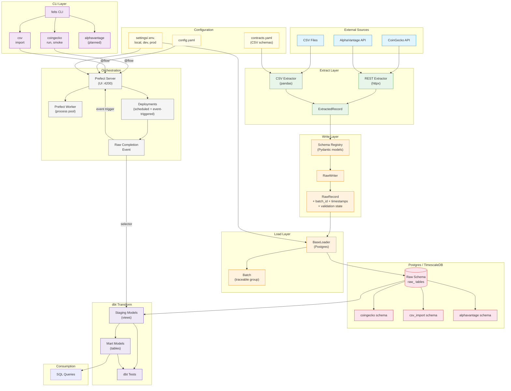
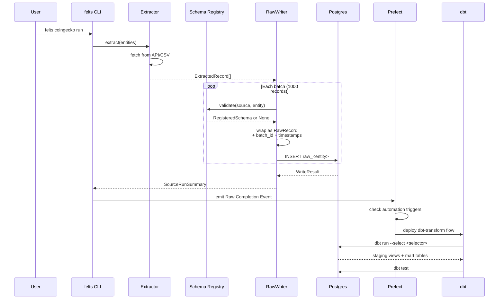
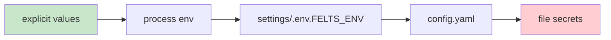

# Felts Architecture

## Pipeline Data Flow

## Layer Responsibilities

| Layer | Responsibility | Key Files |
|-------|---------------|-----------|
| **CLI** | Route commands to source runners | `src/felts/cli.py` |
| **Extract** | Fetch data from APIs/CSV, emit `ExtractedRecord` | `core/extractors/`, `sources/*/extractor.py` |
| **Schema Registry** | Validate payloads against Pydantic models | `core/schemas/registry.py` |
| **RawWriter** | Wrap `ExtractedRecord` → `RawRecord`, assign batch IDs | `core/loaders/writer.py` |
| **Loader** | Persist `RawRecords` to Postgres | `core/loaders/postgres.py` |
| **Orchestration** | Schedule runs, emit events, trigger transforms | `schedules/orchestrator.py`, `sources/*/automations.py` |
| **dbt Transform** | Staging (views) → Marts (tables) | `transforms/models/` |
| **Config** | Settings precedence: explicit > env > .env.<env> > config.yaml | `config/settings.py`, `config.yaml`, `settings/` |

## Settings Precedence

